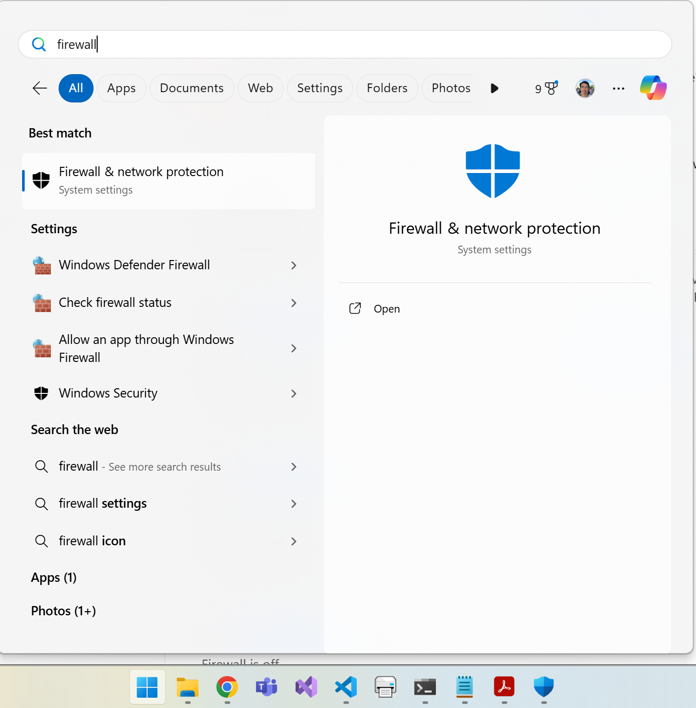
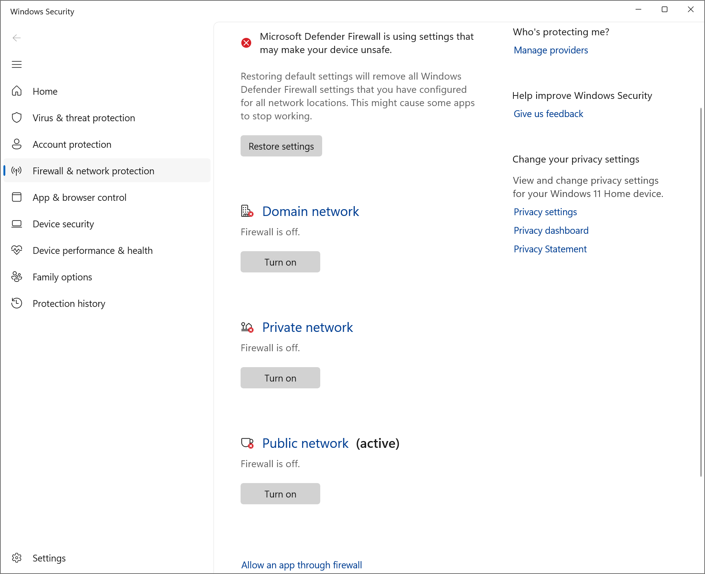
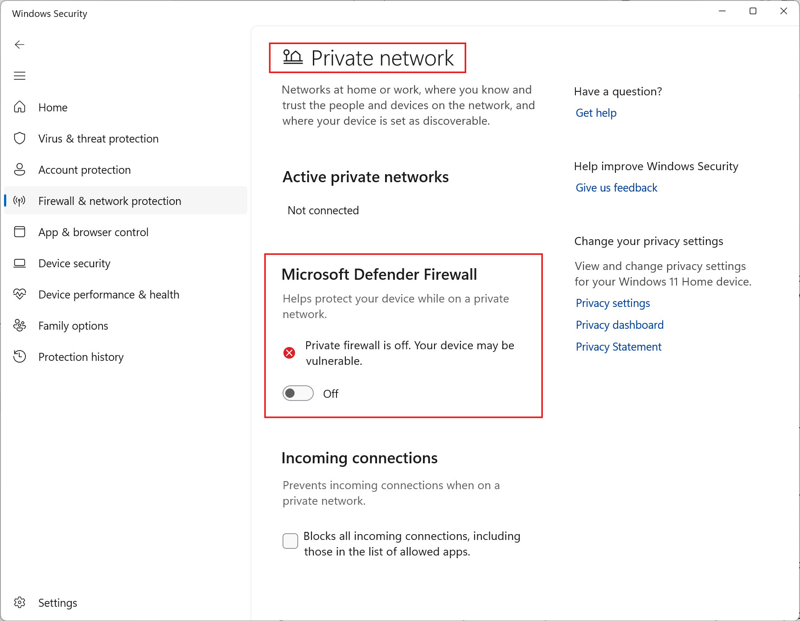

# Digital wallet

This repository provides multiple applications that work together to function as a backend for a digital wallet service. The purpose of each application is described below.

    api_gateway
    Route incoming HTTP requests from the user to the correct backend service. 
    Return the result after processing to the user.

    deposit_service
    Deposit money into wallet

    withdraw_service
    Withdraw money from a wallet

    transfer_service
    Transfer money from one wallet to another

    balance_service
    Retrieve wallet balance

    transaction_history_service
    Retrieve transaction history of wallet

The system design diagram that connects them all can be found in the [./system_design/Simplified digital wallet system.pdf](./system_design/Simplified%20digital%20wallet%20system.pdf) file in this repository.

## Client application

The client application can be found in the **api_client** subfolder of this repository. Once compiled, it can be used to interact with the backend applications to manage your wallet.

This command allows you to deposit an amount of money in the specified wallet in the specified currency.

	api_client deposit <wallet_id> <currency> <amount>

This command allows you to withdraw an amount of money from the specified wallet in the specified currency.

	api_client withdraw <wallet_id> <currency> <amount>

This command allows you to transfer an amount of money from source to destination wallets of the same currency.

	api_client transfer <source_wallet_id> <destination_wallet_id> <currency> <amount>

This command allows you to get the balance of the specified wallet.

	api_client get_balance <wallet_id>

This command allows you to get the transaction history of the specified wallet from a start date to end date, inclusive.

	api_client get_transaction_history <wallet_id> <start_date> <end_date>

## Design of RESTful API

    Deposit money into wallet
    POST /wallets/{wallet_id}/deposits
    {
        "amount": 5000,
        "currency": "XXX"
    }

    Withdraw money from a wallet
    POST /wallets/{wallet_id}/withdrawals
    {
        "amount": 5000,
        "currency": "XXX"
    }

    Transfer money from one wallet to another
    POST /transfer
    {
        "source_wallet_id": "id1",
        "destination_wallet_id": "id2",
        "amount": 5000,
        "currency": "XXX"
    }

    Retrieve balance of a wallet
    GET /wallets/{wallet_id}/balance

    Retrieve transaction history of a wallet
    GET /wallets/{wallet_id}/transaction_history?from=YYYYMMDD&to=YYYYMMDD

## Set up of environment

Firewalls in your test environment may need to be disabled for the Digital Wallet backend to work correctly. The screenshots below show how to disable Windows firewall if you are testing on a Windows machine. 

## Set up of PostgreSQL to store wallet information and transaction histories 

PostgreSQL must be installed and set up correctly on your test computer before running this program. PostgreSQL for Windows can be downloaded here. Instructions to set up the database for other operating systems are not covered due to time constraints.

    https://www.postgresql.org/download/windows/

Once downloaded, install PostgreSQL database with the default installation settings. PostgreSQL should be installed in the following directory by default.

    C:\Program Files\PostgreSQL\17

The installation wizard may also ask you to create a user account for managing the database. Take note of them. 

    Superuser: postgres
    Password: -not-provided-
    Port number: 5432
    Locale: Default

Once installed, this directory will need to be added to the PATH environment variable in Windows such that the commands for running and managing PostgreSQL databases can be accessed from the command prompt.

    C:\Program Files\PostgreSQL\17\bin

Search for **environment** in the start menu. Click on **Edit the system environment variables**.

The **Advanced** tab of the **System Properties** window will show. Click on **Environment Variables...**.

The **Environment Variables** window will show. Under **System Variables** click on **PATH** then click **Edit**.

The **Edit Environment Variable** window will show. Click on **New** then copy **C:\Program Files\PostgreSQL\17\bin** into the new row that appears.

Click **Ok** to save and close the remaining windows.

PostgreSQL should automatically be started up after installation. It it isn't already started up, you can use the following command to do so.

    pg_ctl start -D "database_cluster_directory"
    pg_ctl start -D "C:\Program Files\PostgreSQL\17\data"

Connect to the PostgreSQL database using the following command from the command prompt. There is already a default database automatically created during installation called **postgres**.

    psql -U username -d database_name
    psql -U postgres -d postgres

Create a schema called **wallet** in the **postgres** database.

    create schema wallet;

Create a new **balances** table in the **wallet** schema in the **postgres** database. **wallet_id** can potentially consist of any alphanumeric character of variable length. Currencies can usually be represented using 3 characters (SGD, HKD, USD, GBP, etc.). To make our system as future proof as possible, the largest available integer representation provided by PostgreSQL is used to represent the balance of a wallet. Money is usally not represented using floating point numbers due to precision losses.

    create table postgres.wallet.balances(wallet_id text, currency character(3), balance bigint);

Create a new **transactions** table in the **wallet** schema in the **postgres** database. The exact date and time of each transaction is clearly recorded with its time zone. This avoids confusing timezone conversions later on if the time zones were not specified. A deposit is recorded with a positive amount. A withdrawal is recorded as a negative amount. This allows the balance of a wallet to be easily recomputed using PostgreSQL's SUM() function later on.

    create table postgres.wallet.transactions(wallet_id text, date_and_time timestamptz, currency character(3), amount bigint);

Use the command below to verify that the **postgres.wallet.balances** and **postgres.wallet.transactions** tables were created properly.

    \dt database_name.schema_name.*
    \dt postgres.wallet.*

## Set up of Redis as a message queueing service

Redis is used as an in-memory message queue for passing messages from one backend application to another. It must be installed and set up correctly on your test computer before starting the backend applications. Instructions to install Redis Open Source on Windows Subsystem for Linux (WSL) for Windows can be found here.

    https://redis.io/docs/latest/operate/oss_and_stack/install/archive/install-redis/install-redis-on-windows/

If you don't already have WSL, instructions to install it on your computer can be found here.

    https://learn.microsoft.com/en-us/windows/wsl/install

Once installed, run the following command to start a Redis server on WSL at port 1640 with the **default** username and empty password.

    sudo redis-server --port 1640

Use the following command to shut down the Redis server from another WSL window after you are done testing.

    sudo redis-cli -h localhost -port 1640 shutdown

No other initial set up of the Redis Server needs to be done. Its default settings can be used just fine. The **api_gateway** will automatically request for a new queue to be created on the server when needed. When the last message on each queue is consumed, the consuming application will instruct Redis to delete the queue automatically. 

The names of all message queues used by the backend applications are summarised below. How they relate to each other is shown in the simplified system design diagram.

    deposit_requests_queue
    deposit_responses_queue

    withdrawal_requests_queue
    withdrawal_responses_queue

    transfer_requests_queue
    transfer_responses_queue

    balance_requests_queue
    balance_responses_queue

    transaction_history_requests_queue
    transaction_history_responses_queue

## Library dependencies

    go get github.com/redis/go-redis/v9

## How to compile the code

The go compiler is required to compile the programs in this repository it can be downloaded from [https://go.dev/dl/](https://go.dev/dl/). 

The following commands can be used to update the dependent libraries and compile each program.

    api_gateway
    cd ./api_gateway
    go get all
    go mod tidy
    go build

    deposit_service
    cd ./deposit_service
    go get all
    go mod tidy
    go build

    withdraw_service
    cd ./withdraw_service
    go get all
    go mod tidy
    go build

    transfer_service
    cd ./transfer_service
    go get all
    go mod tidy
    go build

    balance_service
    cd ./balance_service
    go get all
    go mod tidy
    go build

    transaction_history_service
    cd ./transaction_history_service
    go get all
    go mod tidy
    go build

## Running the program

## Running unit tests

