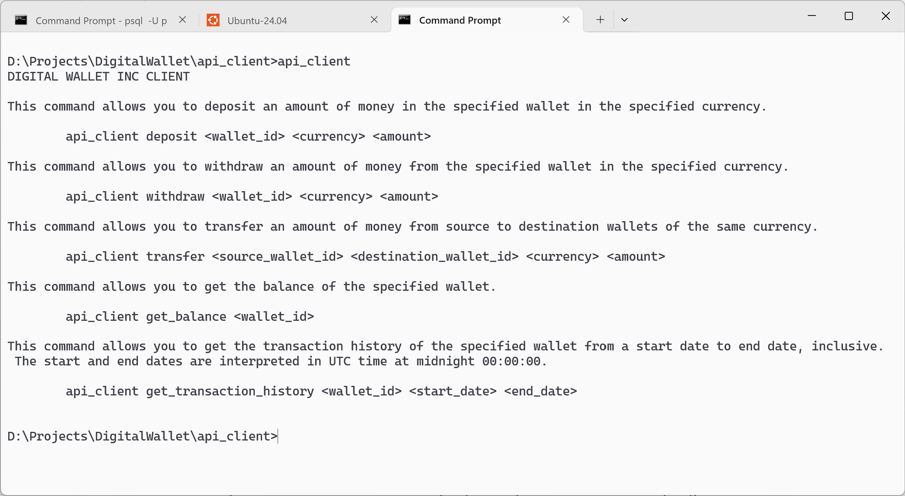

# Digital wallet

This repository provides multiple applications that work together to function as a backend for a digital wallet service. The purpose of each application is described below.

    api_client
    Front end application for depositing money, withdrawing money, transferring money, getting the balance of a wallet and retrieving the transaction history of a wallet. It communicates with the API gateway.

    api_gateway
    Route incoming HTTP requests from the user to the correct backend service. 
    Return the result after processing to the user.

    deposit_service
    Deposit money into wallet

    withdraw_service
    Withdraw money from a wallet

    transfer_service
    Transfer money from one wallet to another

    balance_service
    Retrieve wallet balance

    transaction_history_service
    Retrieve transaction history of wallet

The system design diagram that connects them all can be found in the [./docs/Simplified digital wallet system.pdf](./docs/Simplified%20digital%20wallet%20system.pdf) file in this repository.

## Design of system

### Initial attempt

The initial attempt to design the system is shown in the [./docs/Initial attempt digital wallet system.pdf](./docs/Initial%20attempt%20digital%20wallet%20system.pdf) file in this repository. The first few steps when designing a system is to work out who are its users and what functional and non-functional requirements need to be met to cater to the users.

**Who are its users**

People needing to transfer money locally or across international borders.
Examples: Wise, Grab Wallet

**Functional requirements**

Functional requirements are what the system needs to do, as determined by the customer.

The user must be able to do the following through a client side application using RESTful API calls as described in the question.

- Deposit money into his wallet. The user will have to pay us by bank transfer.
- Withdraw money from his wallet. We will have to pay the user by bank transfer.
- Transfer money from one wallet to another.
- Retrieve the balance of his wallet.
- Retrieve the transaction history of his wallet.

**Non-functional requirements**

Non-functional requirements are the qualities that the system needs to have. 

- System has to be secure. The user must be authenticated before he is allowed to perform any of the above API calls.
- Transactions entered by the user must not be lost: depositing money, withdrawing money, transferring money. The data must be highly durable. This is so that all transactions are traceable and can be restored even in the event of a system crash.
- Highly available. The system must be up 99% or more of the time.
- Highly scalable. The system can be scaled to cater to an exponentially increasing number of users.

The [./docs/Initial attempt digital wallet system.pdf](./docs/Initial%20attempt%20digital%20wallet%20system.pdf) shows an initial attempt to design a system that meets all of the above requirements. Its not complete. Halfway through it, ...

### But, wait a minute

Only 1 person was assigned to do this task over a period of 3 to 5 days! It is becoming clear that he will not be able to build such a highly available, scalable, secure and durable system given the limited resources at hand. 

Targets for both functional and non-functional requirements were thus compromised such that it becomes possible for a single person to build a minimum viable product in 3 to 5 days (72 to 120 hours). The new set of functional and non-functional requirements are described below.

**Functional requirements**

The requirement to transfer money to and from the bank was removed. This greatly reduces development time.

- Deposit money into his wallet. 
- Withdraw money from his wallet.
- Transfer money from one wallet to another.
- Retrieve the balance of his wallet.
- Retrieve the transaction history of his wallet.

**Non-functional requirements**

Instead of trying to achieve the grandiose objectives of being highly scalable, available, secure and durable,

- The system has to be cheap to build and simple enough for 1 person to build in 3 to 5 days.
- At the very least, the system must be potentially scalable and have some of the beneficial characteristics of a highly distributed system.

### Final system design

This new simplified system design diagram was the result of simplfying the requirements that need to be met.

[./docs/Simplified digital wallet system.pdf](./docs/Simplified%20digital%20wallet%20system.pdf)

At the very least, this new system was designed to give you the potential to scale. It does do by having a separate backend service for each functional requirement that needs to be met. 

- Deposit money into his wallet. 
- Withdraw money from his wallet.
- Transfer money from one wallet to another.
- Retrieve the balance of his wallet.
- Retrieve the transaction history of his wallet.

The user device first sends the request to the API gateway. The API gateway then puts the request into a message queue to be processed by another service (deposit service, withdraw service, transfer service, etc.) which updates the database directly. Using a queue decouples the performance of the upstream and downstream applications.

There may come a point where the number of people the system needs to cater to exponentially increases. One way to scale such a system is to partition the database where each partition stores only a subset of user data. If updating the database is the bottle neck, the microservice architecture of this simplfied system design allows us to scale simply by connecting the API gateway to more instances of backend service responsible for performing the function. See the PDF document below for an example. The example below also describes how consistent hashing can be used to distribute user data over several database partitions.

[./docs/Example of scalability.pdf](./docs/Example%20of%20scalability.pdf)

A microservice architecture also helps to improve the availability of the system. If the deposit service is down, the user will still be able to withdraw from his wallet and view his transactions. 

### Design of database tables

For simplicity, the system was not designed not maintain a table of user data (username, name, address, date of bith etc.). The system only maintains two tables. One for storing transactions and one for storing balances. Each unique wallet ID corresponds to a user account opened with us. Each wallet is associated with 1 currency only. The user only needs to member his wallet ID to use our digital wallet. A user may open multiple wallets with us, each of a different currency, if he chooses to do so.

The **balances** table stores only the wallet ID, currency and balance of a user wallet. Balances are stored as integers to avoid precision loss. The user can enter an amount up to 2 decimal places (0.01). The amount is multiplied by 100 before saving it to the database (0.01 becomes 1). 

    Wallet ID, Currency, Balance
    wallet_id_1, SGD, 10000

The **transactions** table stores the wallet ID, date and time, currency and amount of a transaction. A deposit is indicated by a positive amount. A withdrawal is indicated by a negative amount. This allows the balance of a wallet to be easily computed using database functions later on (if needed).

    Wallet ID, Date and time UTC, Currency, Amount
    wallet_id_1, YYYYMMDD-HH:MM:SS, SGD, 10000
    wallet_id_1, YYYYMMDD-HH:MM:SS, SGD, -2000

### Design of RESTful API

    Deposit money into wallet
    POST /wallets/{wallet_id}/deposits
    {
        "amount": 5000,
        "currency": "XXX"
    }

    Withdraw money from a wallet
    POST /wallets/{wallet_id}/withdrawals
    {
        "amount": 5000,
        "currency": "XXX"
    }

    Transfer money from one wallet to another
    POST /transfer
    {
        "source_wallet_id": "id1",
        "destination_wallet_id": "id2",
        "amount": 5000,
        "currency": "XXX"
    }

    Retrieve balance of a wallet
    GET /wallets/{wallet_id}/balance

    Retrieve transaction history of a wallet
    GET /wallets/{wallet_id}/transaction_history?from=YYYYMMDD&to=YYYYMMDD

## Client application

The client application can be found in the **api_client** subfolder of this repository. Once compiled, it can be used to interact with the backend applications to manage your wallet. You must follow all the steps described later in this document to set up your test environment to get it to work.

This command allows you to deposit an amount of money in the specified wallet in the specified currency. This is also how an acccount is first created. You need to deposit at least 0.01 of any currency to create an account with us. The specified currency symbol must have exactly 3 characters.

	api_client deposit <wallet_id> <currency> <amount>

This command allows you to withdraw an amount of money from the specified wallet in the specified currency.

	api_client withdraw <wallet_id> <currency> <amount>

This command allows you to transfer an amount of money from source to destination wallets of the same currency.

	api_client transfer <source_wallet_id> <destination_wallet_id> <currency> <amount>

This command allows you to get the balance of the specified wallet.

	api_client get_balance <wallet_id>

This command allows you to get the transaction history of the specified wallet from a start date to end date, inclusive. The start and end dates are interpreted in UTC time at midnight 00:00:00.

	api_client get_transaction_history <wallet_id> <start_date> <end_date>

A demo of Digital Wallet in action is shown in this video here.

    https://www.youtube.com/watch?v=H_BYeeOGn_I

## How to review the code

The root directory of this repository does not contain a project that can be compiled. It contains several different applications and libraries in different subfolders. The applications and libraries are used in a manner conforming to the simplfiied system design diagram previously mentioned.

[./docs/Simplified digital wallet system.pdf](./docs/Simplified%20digital%20wallet%20system.pdf)

What is contained within each subfolder is described below.

    ./api_client
    Project for api_client application. Can be compiled and executed. 

    ./api_gateway
    Project for api_gateway application. Can be compiled and executed. 

    ./balance_service
    Project for balance service which retrieves the balance of a wallet from the PostgreSQL database. It can be compiled and executed.

    ./deposit_service
    Project for deposit service which handles updating the PostgreSQL database when depositing money into a wallet. It can be compiled and executed.

    ./docs
    Additional documentation.

    ./images
    Media supporting the documentation.

    ./shared
    A local library shared and imported by all applications. Cannot be compiled directly but can be unit tested.

    ./transaction_history_service
    Project for transaction history service which retrieves the transaction history of a wallet from the PostgreSQL database.

    ./transfer_service
    Project for transfer service which updates the PostgreSQL database when transferring money from one wallet to another.

    ./withdraw_service
    Project for withdraw service which updates the PostgreSQL database when withdrawing money from a wallet.

The flow of data in the API gateway can be difficult to understand. A system design diagram of the inner workings of the API gateway is provided here. 

[./docs/System design diagram of API gateway.pdf](./docs/System%20design%20diagram%20of%20API%20gateway.pdf)

The other applications are straight forward processes with a single thread. They do not need to be explained with a system design diagram. The single thread in the balance service, deposit service, transaction history service, transfer service and withdraw service simply gets the next request message from the input queue, updates or reads the database and puts its response into the output queue.

Each project for an executable service contains a **config** subdirectory. This is where code for its configuration file is managed. The inner workings of each executable service is placed in the **implementation** subdirectory. There may also be other subfolders for each executable service that contains code that are commonly reused.

If you are unsure of how the applications relate to each other, refer to the system design diagrams!

## Set up of environment

Firewalls in your test environment may need to be disabled for the Digital Wallet backend to work correctly. The screenshots below show how to disable Windows firewall if you are testing on a Windows machine. 

## Set up of PostgreSQL to store wallet information and transaction histories 

PostgreSQL must be installed and set up correctly on your test computer before running this program. PostgreSQL for Windows can be downloaded here. Instructions to set up the database for other operating systems are not covered due to time constraints.

    https://www.postgresql.org/download/windows/

Once downloaded, install PostgreSQL database with the default installation settings. PostgreSQL should be installed in the following directory by default.

    C:\Program Files\PostgreSQL\17

The installation wizard may also ask you to create a user account for managing the database. Take note of them. 

    Superuser: postgres
    Password: postgres
    Port number: 5432
    Locale: Default

Once installed, this directory will need to be added to the PATH environment variable in Windows such that the commands for running and managing PostgreSQL databases can be accessed from the command prompt.

    C:\Program Files\PostgreSQL\17\bin

Search for **environment** in the start menu. Click on **Edit the system environment variables**.

The **Advanced** tab of the **System Properties** window will show. Click on **Environment Variables...**.

The **Environment Variables** window will show. Under **System Variables** click on **PATH** then click **Edit**.

The **Edit Environment Variable** window will show. Click on **New** then copy **C:\Program Files\PostgreSQL\17\bin** into the new row that appears.

Click **Ok** to save and close the remaining windows.

PostgreSQL should automatically be started up after installation. It it isn't already started up, you can use the following command to do so in the command prompt, if you have set your environment variables correctly.

    pg_ctl start -D "database_cluster_directory"
    pg_ctl start -D "C:\Program Files\PostgreSQL\17\data"

Connect to the PostgreSQL database using the following command from the command prompt. It opens the command line interface for PostgreSQL. There is already a default database automatically created during installation called **postgres**.

    psql -U username -d database_name
    psql -U postgres -d postgres

The steps after this are all performed from within the PSQL command line interface.

Create a schema called **wallet** in the **postgres** database.

    create schema wallet;

Create a new **balances** table in the **wallet** schema in the **postgres** database. **wallet_id** can potentially consist of any alphanumeric character of variable length. Currencies can usually be represented using 3 characters (SGD, HKD, USD, GBP, etc.). To make our system as future proof as possible, the largest available integer representation provided by PostgreSQL is used to represent the balance of a wallet. Money is usally not represented using floating point numbers due to precision losses.

    create table postgres.wallet.balances(wallet_id text, currency character(3), balance bigint);

Create a new **transactions** table in the **wallet** schema in the **postgres** database. The exact date and time of each transaction is clearly recorded with its time zone. This avoids confusing timezone conversions later on if the time zones were not specified. As a rule of thumb, all transactions saved in UTC time zone. A deposit is recorded with a positive amount. A withdrawal is recorded as a negative amount. This allows the balance of a wallet to be easily recomputed using PostgreSQL's SUM() function later on. 

    create table postgres.wallet.transactions(wallet_id text, date_and_time timestamptz, currency character(3), amount bigint);

Use the command below to verify that the **postgres.wallet.balances** and **postgres.wallet.transactions** tables were created properly.

    \dt database_name.schema_name.*
    \dt postgres.wallet.*

## Set up of Redis as a message queueing service

Redis is used as an in-memory message queue for passing messages from one backend application to another. It must be installed and set up correctly on your test computer before starting the backend applications. Instructions to install Redis Open Source on Windows Subsystem for Linux (WSL) for Windows can be found here.

    https://redis.io/docs/latest/operate/oss_and_stack/install/archive/install-redis/install-redis-on-windows/

If you don't already have WSL, instructions to install it on your computer can be found here.

    https://learn.microsoft.com/en-us/windows/wsl/install

Once installed, run the following command to start a Redis server on WSL at port 1640 with the **default** username and empty password.

    sudo redis-server --port 1640

Use the following command to shut down the Redis server from another WSL window after you are done testing.

    sudo redis-cli -h localhost -port 1640 shutdown

No other initial set up of the Redis Server needs to be done. Its default settings can be used just fine. The **api_gateway** will automatically request for a new queue to be created on the server when needed. When the last message on each queue is consumed, the consuming application will instruct Redis to delete the queue automatically. 

The names of all message queues used by the backend applications are summarised below. How they relate to each other is shown in the simplified system design diagram.

    deposit_requests_queue
    deposit_responses_queue

    withdrawal_requests_queue
    withdrawal_responses_queue

    transfer_requests_queue
    transfer_responses_queue

    balance_requests_queue
    balance_responses_queue

    transaction_history_requests_queue
    transaction_history_responses_queue

## How to compile the code

The go compiler is required to compile the programs in this repository it can be downloaded from [https://go.dev/dl/](https://go.dev/dl/). 

Since each subdirectory hosts a different Go application, you will need to change into the directory of each application to compile the code.

    api_client
    cd ./api_client
    go get all
    go mod tidy
    go build

    api_gateway
    cd ./api_gateway
    go get all
    go mod tidy
    go build

    deposit_service
    cd ./deposit_service
    go get all
    go mod tidy
    go build

    withdraw_service
    cd ./withdraw_service
    go get all
    go mod tidy
    go build

    transfer_service
    cd ./transfer_service
    go get all
    go mod tidy
    go build

    balance_service
    cd ./balance_service
    go get all
    go mod tidy
    go build

    transaction_history_service
    cd ./transaction_history_service
    go get all
    go mod tidy
    go build

Alternatively, you can also use this script in the root directory of the project to automatically compile all applications.

    build_all.bat

### Library dependencies

The following are third party library dependencies used by the source code. Try retrieving them manually if you have problems compiling the applications.

    go get github.com/redis/go-redis/v9
    go get github.com/lib/pq
    go get gopkg.in/yaml.v3

Another thing to note is that the **shared** folder in this repository is actually a DIY library for code comonly reused among all the backend applications. It is referred to by adding the following line to the **go.mod** file of each project (deposit service, withdraw service, etc.).

    replace shared => ../shared

## Running the program

You should not need to change anything in the configuration file (**config.yml**) file for each backend service if you have set up the Redis and PostgreSQL databases correctly.

After compiling, in Windows, double click on the executable file for each backend service from their subdirectories. 

    balance_service.exe
    deposit_service.exe
    transaction_history_service.exe
    transfer_service.exe
    withdraw_service.exe
    api_gateway.exe

Alternatively, you can also use this script in the root directory of the project to automatically start up all applications after compiling.

    start_backend_services.bat

This is also a script that allows you to shutdown all backend services easily.

    shutdown_all.bat

Finally, navigate to the **./api_client** subdirectory of this project in the command prompt and run the commands described previously to test the application. You can view the help menu by running **api_client.exe** or **api_client** without any other options.

## Unit tests

The unit tests were not written to achieve 100% code coverage. They were written to test that the core functionality of each backend module works, especially when there is fiddly logic involved. Unit tests are only written where it makes sense to.

The unit tests rely on having an actual instance of both Redis and PostgreSQL to work. You need to ensure that they are set up correctly as described below. Some developers might prefer using mock libraries for unit testing code that connects to an external resource (databases, etc.). However, I prefer to set up the actual resources for testing. Setting up actual resoures for unit testing gives you more authentic feedback on what would happen in production.

### Test Redis instance

Make sure Redis is started up and available for connection with the following settings.

    Host:                           localhost
    Port:                           1640
    Username:                       default
    Password:                       

The unit tests will automatically create and delete these additional queues in Redis. No further action needs to be done.

    deposit_requests_queue_test
    deposit_responses_queue_test

    withdrawal_requests_queue_test
    withdrawal_responses_queue_test

    transfer_requests_queue_test
    transfer_responses_queue_test

    balance_requests_queue_test
    balance_responses_queue_test

    transaction_history_requests_queue_test
    transaction_history_responses_queue_test

    api_gateway_requests_queue_test
    api_gateway_responses_queue_test

### Test PostgreSQL instance

Make sure PostgreSQL is started up and available for connection with the following settings.

    Host:                           localhost
    Port:                           5432
    Username:                       postgres
    Password:                       postgres
    Database:                       postgres

You need to create additional **balances** and **transactions** tables in schemas used for testing.

    -- Create resources for testing the balance service.
    create schema test_balance_service;
    create table postgres.test_balance_service.balances(wallet_id text, currency character(3), balance bigint);
    create table postgres.test_balance_service.transactions(wallet_id text, date_and_time timestamptz, currency character(3), amount bigint);

    -- Create resources for testing the deposit service
    create schema test_deposit_service;
    create table postgres.test_deposit_service.balances(wallet_id text, currency character(3), balance bigint);
    create table postgres.test_deposit_service.transactions(wallet_id text, date_and_time timestamptz, currency character(3), amount bigint);

    -- Create resources for testing the transaction history service
    create schema test_transaction_history_service;
    create table postgres.test_transaction_history_service.balances(wallet_id text, currency character(3), balance bigint);
    create table postgres.test_transaction_history_service.transactions(wallet_id text, date_and_time timestamptz, currency character(3), amount bigint);

    -- Create resources for testing the transfer service
    create schema test_transfer_service;
    create table postgres.test_transfer_service.balances(wallet_id text, currency character(3), balance bigint);
    create table postgres.test_transfer_service.transactions(wallet_id text, date_and_time timestamptz, currency character(3), amount bigint);

    -- Create resources for testing the withdraw service
    create schema test_withdraw_service;
    create table postgres.test_withdraw_service.balances(wallet_id text, currency character(3), balance bigint);
    create table postgres.test_withdraw_service.transactions(wallet_id text, date_and_time timestamptz, currency character(3), amount bigint);

### Run the unit tests

Since each subdirectory of this project hosts a different application, you need to change into that subdirectory before running the unit tests for that application. This can be done like shown below.

    # This is a comment

    # From root directory of this project
    cd ./api_client
    go test ./...

    # From root directory of this project
    cd ./api_gateway
    go test ./...

    # From root directory of this project
    cd ./balance_service
    go test ./...

    # From root directory of this project
    cd ./deposit_service
    go test ./...

    # From root directory of this project
    cd ./shared
    go test ./...

    # From root directory of this project
    cd ./transaction_history_service
    go test ./...

    # From root directory of this project
    cd ./transfer_service
    go test ./...

    # From root directory of this project
    cd ./withdraw_service
    go test ./...

There is also a helper script in the root directory of this repository that allows you to run all the unit tests in one command.

    run_unit_tests.bat

## Areas of improvement

1. Redis is currently used to transfer messages from one service to another. The messages are not persistent. Data can be lost if any of the queues crash. Find a way to have redis log each request received to disk.

2. The system needs to interact with actual banks if it is to be deployed in production. It will be much more complex. Nobody wants to use banana money in real life.

3. Security. No authentication was built into this system due to time and resource constraints. Security must be built in before anyone will even consider using this sytem since we are handling money. We can consider password authentication and two factor authentication.

4. The basic system design by itself is not highly available, we would need to think how the database, message queues, API gateway and request processing services can be replicated to ensure high availability.

5. Scalability is achieved through replication and sharding. Several techniques exist to distribute user data over multiple databases. Consistent hashing, lookup service pattern, range based techniques, etc.

6. Due to time constraints, performance testing has not been done to determine if the system will be able to handle production load. This is key to determining whether our system is inadequate, sufficient or significantly overperforming. It is a waste of time and money to build a system that substantally exceeds performance requirements.

7. The DIY algorithms for detecting wildcards, keys and values in in URL paths and for converting from integer to string representation of balances can be improved. While the algorithms are already the most optimal, they still use Go's string concatentation operator to append characters to the end of a string which always needs to reallocate memory. Using a block of bytes that gets allocated once only on program startup and a pointer to the next element to copy data can prevent wasteful reallocations when the program is running and further reduce the time complexity of the algorithm.

8. Due to time constraints, I could not build an error reporting service into the backend applications. An error reporting service is required in a production set up such that the system administrator is notified of any anomalies that should not happen in production. The error reports may be sent by email or SMS.

## Does it satisfy functional and non-functional requirements? 

I managed to build a system that meets the minimum functional requirements of the system as requested for this assignment. We have a backend system (api gateway, balance service, deposit service, withdraw service, transfer service and transaction history service) and a corresponding front end client application (api_client) that works in synchrony to deliver these 5 services.

- Deposit money into his wallet. 
- Withdraw money from his wallet.
- Transfer money from one wallet to another.
- Retrieve the balance of his wallet.
- Retrieve the transaction history of his wallet.

This system also satisfies this non-functional requirement.

- At the very least, the system must be potentially scalable and have some of the beneficial characteristics of a highly distributed system.

Its microservice architecture and distributed nature makes its easily scalable and extendable. It also improves the availability of the system. e.g. If the deposit service fails, the other services may remain up and running and the user may still be able to withdraw money and view their transaction histories.

## Which features did I not do?

A lot more work still needs to be done before this system can be used in production.

1. Security. Password authentication. Two factor authentication.
2. Ensuring high availability
3. Performance testing.
4. Ensuring low latency.
5. Data durability. Requests can currently be lost if any of the backend services crashes.
6. Set up of error reporting service
7. Set up of backend monitoring service.
8. Interaction with banking systems.

## How much time I spent

Approximately 49 to 50 hours hours over 4 days.

    13/06/2025
    09:00 to 18:00
    21:00 to 01:00 
    13 hours

    14/05/2025
    9:30 to 11:30
    12:00 to 21:30
    11.5 hours

    15/05/2025
    10:00 to 11:55
    13:25 to 00:45
    13 hours

    16/06/2026
    9:30 to 21:50
    12.3 hours

## Is my solution simple?

This solution is about as simple as it gets that still provides some beneficial characteristics of a highly distributed system.

There is one even simpler solution which is to build all services into one monolithic backend application. But this solution cannot be scaled. The entire service will go down if the single monolithic backend application crashes.

